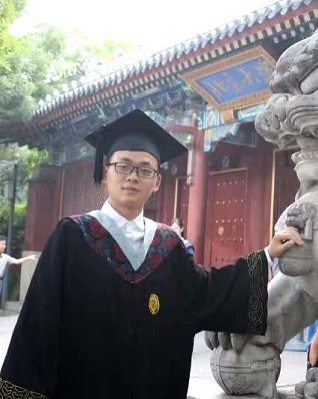
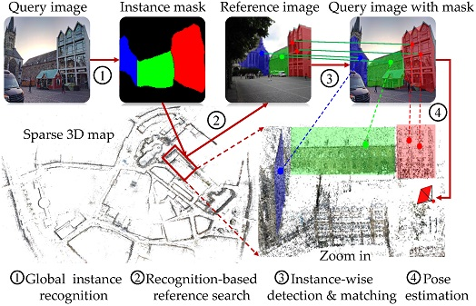
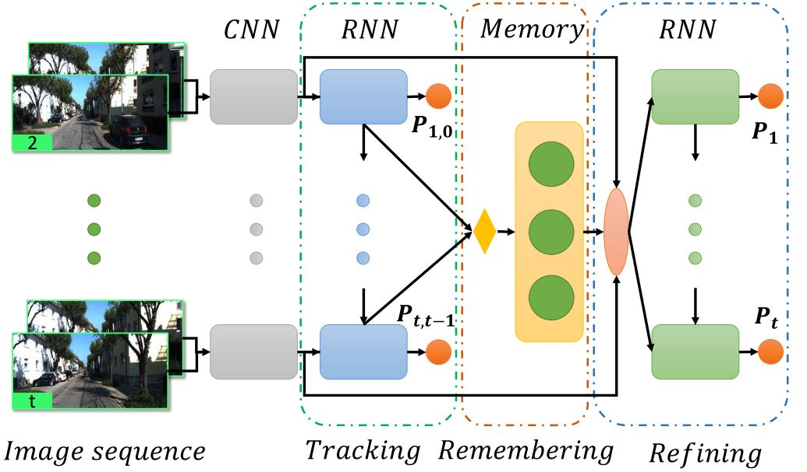
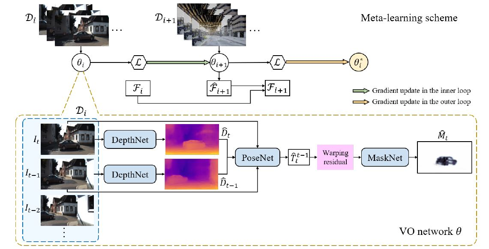
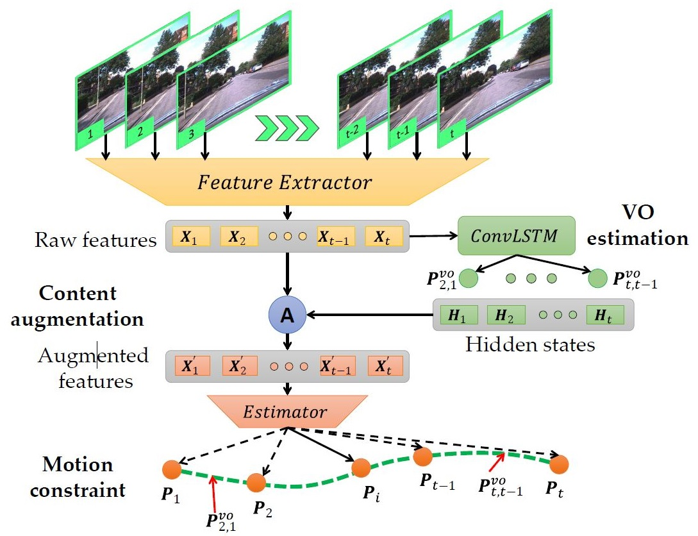
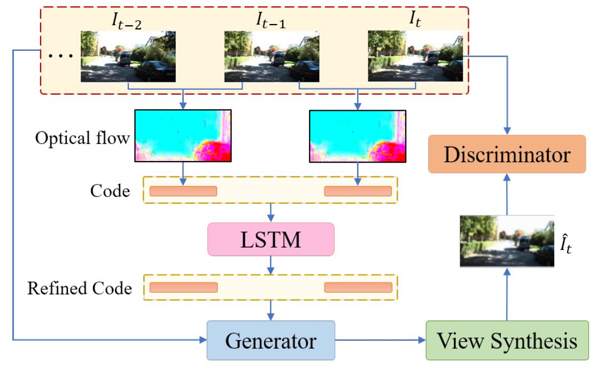
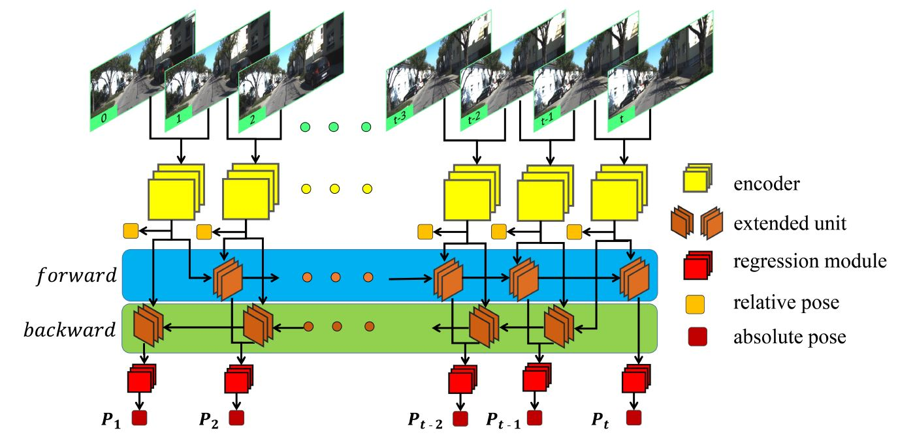
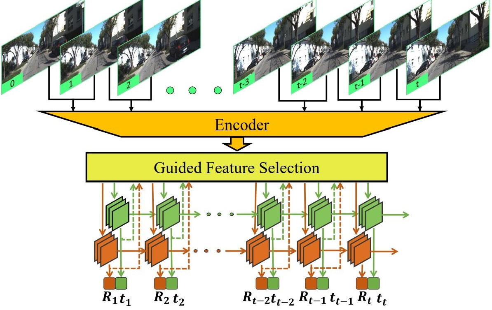
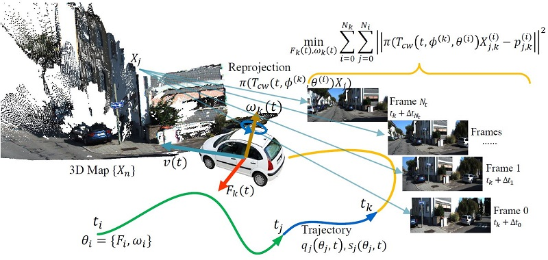

---
# Feel free to add content and custom Front Matter to this file.
# To modify the layout, see https://jekyllrb.com/docs/themes/#overriding-theme-defaults
title: Welcome
layout: page_no_title
---
<table style="border:0px">
<tr style="border:0px">
	<td style="border:0px">
		
	</td>
	<td style="border:0px">
		I am a PhD candidate in <a href="http://mi.eng.cam.ac.uk/">Machine Intelligence Laboratory</a>, University of Cambridge and work with Prof. <a href="https://mi.eng.cam.ac.uk/~cipolla/biography.htm"> Roberto Cipolla</a> and Dr. <a href="http://mi.eng.cam.ac.uk/~ib255/"> Ignas Budvytis</a>. My research interests include SLAM, visual odometry, relocalization, and visual perception. 
	    In 2016-2019, I was a master student under the supervision of Prof. <a href="http://www.cis.pku.edu.cn/vision/Visual&Robot/people/zha%20hongbin/zha%20hongbin.htm">Hongbin Zha</a> in computer vision at <a href="http://www.klmp.pku.edu.cn/">Key Laboratory of Machine Perception</a>, Peking University. 
		Before that, I received the B.S. degree in machine intelligence from School of EECS, Peking University in 2016. 
		<a href="https://scholar.google.ca/citations?user=G2sYDPkAAAAJ&hl=en">[Google Scholar]</a><a href="https://github.com/feixue94">[Github]</a>
	</td>
</tr>
</table>

## Services
* Reviewer of IROS, WACV, CVPR, ECCV, ICLR 

## Publications
<table style="border:0px">

<tr style="border:0px">
	<td style="border:0px">
		
	</td>
	<td style="border:0px">
		Efficient Large-scale Localization by Global Instance Recognition 
		<b>Fei Xue</b>, Ignas Budvytisy, Daniel Olmeda Reinoz, Roberto Cipolla 
		<i>Conference on Computer Vision and Pattern Recognition (CVPR)</i>, 2022 
		Keywords: relocalization, semantics, instances 
	</td>
</tr>

<tr style="border:0px">
	<td style="border:0px">
		
	</td>
	<td style="border:0px">
		Deep Visual Odometry with Adaptive Memory 
		<b>Fei Xue</b>, Xin Wang, Junqiu Wang, Hongbin Zha 
		<i>Transactions on Pattern Analysis and Machine Intelligence (TPAMI)</i>, 2022 
		Keywords: learning-based visual odometry, memory 
	</td>
</tr>

<tr style="border:0px">
	<td style="border:0px">
		
	</td>
	<td style="border:0px">
		Learning Multi-view Camera Relocalization with Graph Neural Networks 
		<b>Fei Xue</b>, Xin Wu, Shaojun Cai, Junqiu Wang 
		<i>Conference on Computer Vision and Pattern Recognition (CVPR)</i>, 2020 
		Keywords: GNN, relocalization, multi-view images 
		<a href="https://openaccess.thecvf.com/content_CVPR_2020/papers/Xue_Learning_Multi-View_Camera_Relocalization_With_Graph_Neural_Networks_CVPR_2020_paper.pdf">[pdf]</a>
		<a href="https://www.youtube.com/watch?v=WJ4b3fVNHLo">[video]</a>
		<a href="https://feixue94.github.io/">[code]</a>
	</td>
</tr>

<tr style="border:0px">
	<td style="border:0px">
		
	</td>
	<td style="border:0px">
		Self-Supervised Deep Visual Odometry with Online Adaptation 
		Shunkai Li, Xin Wang, Yingdian Cao, <b>Fei Xue</b>,  Zike Yan, Hongbin Zha 
		<i>Conference on Computer Vision and Pattern Recognition (CVPR)</i>, 2020 
		Keywords: visual odometry, online learning, multi-view images 
		<a href="https://arxiv.org/pdf/2005.06136.pdf">[pdf]</a>
		<a href="https://www.youtube.com/watch?v=yK9M5giH84w">[video]</a>
		Oral
	</td>
</tr>

<tr style="border:0px">
	<td style="border:0px">
		
	</td>
	<td style="border:0px">
		Local Supports Global: Deep Camera Relocalization with Sequence Enhancement 
		<b>Fei Xue</b>, Xin Wang, Zike Yan, Qiuyuan Wang, Junqiu Wang, Hongbin Zha 
		<i>International Conference on Computer Vision (ICCV)</i>, 2019 
		Keywords: relocalization, multi-view images 
		<a href="https://arxiv.org/pdf/1908.04391.pdf">[pdf]</a>
		<a href="https://feixue94.github.io/">[code]</a>
	</td>
</tr>

<tr style="border:0px">
	<td style="border:0px">
		
	</td>
	<td style="border:0px">
		Sequential Adversarial Learning for Self-Supervised Deep Visual Odometry 
		Shunkai Li, <b>Fei Xue</b>, Xin Wang, Zike Yan, Hongbin Zha 
		<i>International Conference on Computer Vision (ICCV)</i>, 2019 
		Keywords: self-supervised visual odometry, GAN 
		<a href="https://arxiv.org/pdf/1908.08704.pdf">[pdf]</a>
	</td>
</tr>

<tr style="border:0px">
	<td style="border:0px">
		
	</td>
	<td style="border:0px">
		Beyond Tracking: Selecting Memeory and Refining Poses for Deep Visual Ododmetry 
		<b>Fei Xue</b>, Xin Wang, Shunkai Li, Qiuyuan Wang, Junqiu Wang, Hongbin Zha 
		<i>Conference on Computer Vision and Pattern Recognition (CVPR)</i>, 2019 
		Keywords: learning-based visual odometry, memory 
		<a href="https://arxiv.org/pdf/1904.01892.pdf">[pdf]</a>
		<a href="https://feixue94.github.io/">[code]</a>
		Oral
	</td>
</tr>

<tr style="border:0px">
	<td style="border:0px">
		
	</td>
	<td style="border:0px">
		Visual Odometry with Deep Bidirectional Recurrent Neural Networks 
		<b>Fei Xue</b>, Xin Wang, Qiuyuan Wang, Junqiu Wang, Hongbin Zha 
		<i>Chinese Conference on Pattern Recognition and Computer Vision (PRCV)</i>, 2019 
		Keywords: learning-based visual odometry, LSTM 
		<a href="https://link.springer.com/chapter/10.1007/978-3-030-31726-3_20">[pdf]</a>
		<a href="https://feixue94.github.io/">[code]</a>
		Oral
	</td>
</tr>

<tr style="border:0px">
	<td style="border:0px">
		
	</td>
	<td style="border:0px">
		Guided Feature Selection for Deep Visual Odometry 
		<b>Fei Xue</b>, Qiuyuan Wang, Xin Wang, Wei Dong, Junqiu Wang, Hongbin Zha 
		<i>Asian Conference on Computer Vision (ACCV)</i>, 2018 
		Keywords: learning-based visual odometry, motion-separation, guidance 
		<a href="https://arxiv.org/pdf/1811.09935.pdf">[pdf]</a>
		<a href="https://feixue94.github.io/">[code]</a>
	</td>
</tr>
<tr style="border:0px">
	<td style="border:0px">
		
	</td>
	<td style="border:0px">
		Continuous-time Stereo Visual Odometry Based on Dynamics Model 
		Xin Wang, <b>Fei Xue</b>, Zike Yan, Wei Dong, Qiuyuan Wang, Hongbin Zha 
		<i>Asian Conference on Computer Vision (ACCV)</i>, 2018 
		Keywords: geometric visual odometry, dynamics model 
		<a href="https://www.researchgate.net/publication/332103736_Continuous-time_Stereo_Visual_Odometry_Based_on_Dynamics_Model">[pdf]</a>
	</td>
</tr>
</table>