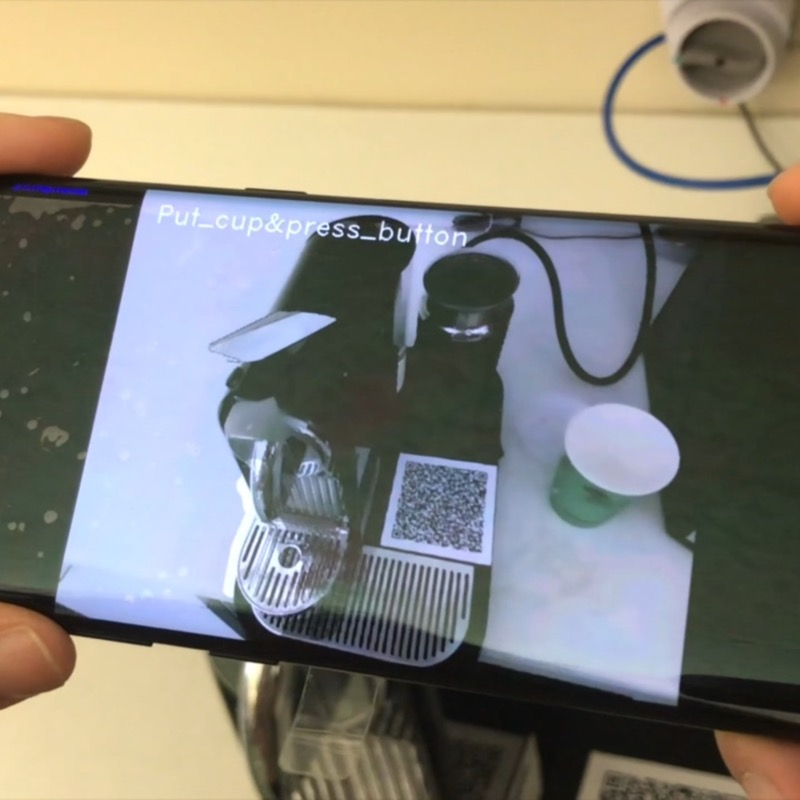
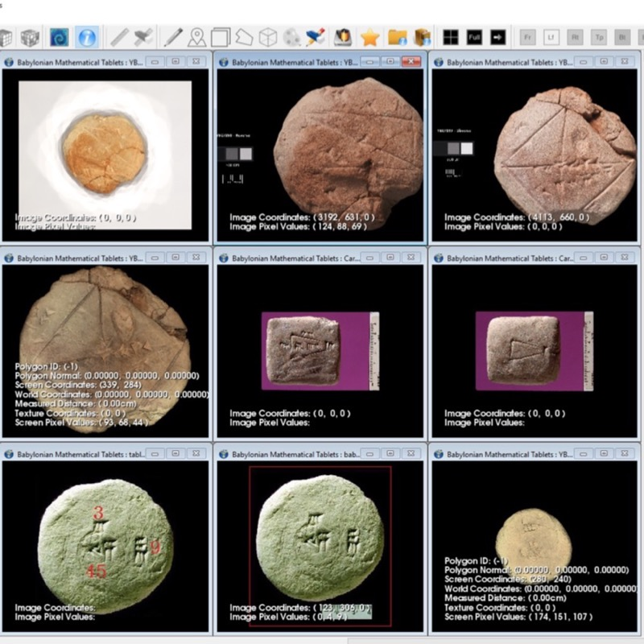
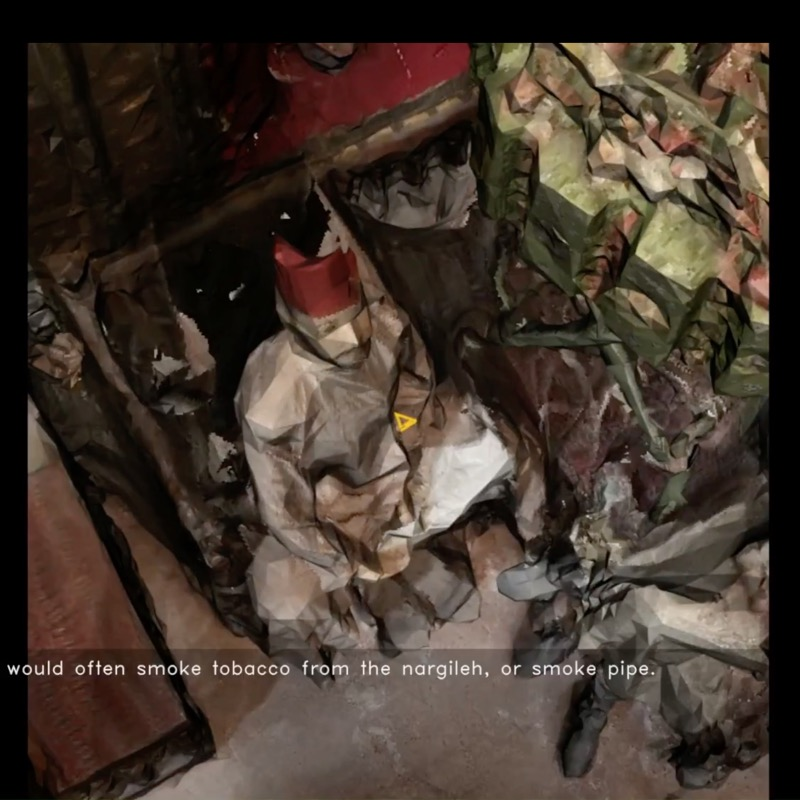
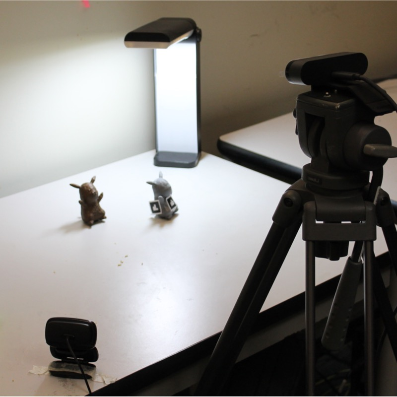
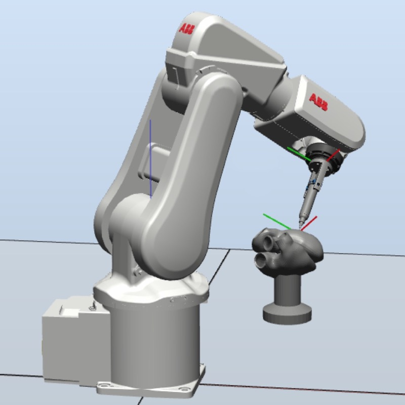

---
# Feel free to add content and custom Front Matter to this file.
# To modify the layout, see https://jekyllrb.com/docs/themes/#overriding-theme-defaults
title: Welcome
layout: page_no_title
---
<table style="border:0px">
<tr style="border:0px">
	<td style="border:0px">
		
	</td>
	<td style="border:0px">
		I am a Ph.D. candidate in computer graphics at Yale University. My research interests include sketching, cultural heritage, VR/AR, visual perception, and intelligent interfaces for creative applications.  
		Before coming to Yale, I received the B.S. degree (Summa Cum Laude) in machine intelligence from School of EECS, Peking University in 2016.  
		<a href="http://graphics.cs.yale.edu/site/">[Yale Graphics Group]</a> 
		<a href="https://scholar.google.com/citations?user=q7NLPG0AAAAJ">[Google Scholar]</a>
		<a href="https://www.researchgate.net/profile/Zeyu_Wang4">[ResearchGate]</a>
		<a href="https://www.linkedin.com/in/zachzeyuwang">[LinkedIn]</a>
	</td>
</tr>
</table>

## Publications
<table style="border:0px">
<tr style="border:0px">
	<td style="border:0px">
		
	</td>
	<td style="border:0px">
		<b>Zeyu Wang</b>, Shiyu Qiu, Qingyang Chen, Natallia Trayan, Alexander Ringlein, Julie Dorsey, Holly Rushmeier 
		AniCode: Authoring Coded Artifacts for Network-Free Personalized Animations 
		<i>The Visual Computer</i>, 2019 
		<a href="https://www.researchgate.net/publication/332972892_AniCode_Authoring_Coded_Artifacts_for_Network-Free_Personalized_Animations">[pdf]</a>
		<a href="https://youtu.be/qqzOLu47alw">[video]</a>
		<a href="http://tracer.cs.yale.edu/anicode">[demo]</a>
		<a href="https://github.com/zachzeyuwang/AniCode">[code]</a>
		<a onclick="copyBibTeX(8)">[bibtex]</a>
	</td>
</tr>
<tr style="border:0px">
	<td style="border:0px">
		
	</td>
	<td style="border:0px">
		<b>Zeyu Wang</b>, Weiqi Shi, Kiraz Akoglu, Eleni Kotoula, Ying Yang, Holly Rushmeier 
		CHER-Ob: A Tool for Shared Analysis and Video Dissemination 
		<i>ACM Journal on Computing and Cultural Heritage (JOCCH)</i>, 2018 
		<a href="https://www.researchgate.net/publication/325253431_CHER-Ob_A_Tool_for_Shared_Analysis_and_Video_Dissemination">[pdf]</a>
		<a href="http://graphics.cs.yale.edu/site/cher-ob-open-source-platform-shared-analysis-cultural-heritage-research">[project]</a>
		<a href="https://github.com/WeiqiJust/CHER-Ob">[code]</a>
		<a onclick="copyBibTeX(7)">[bibtex]</a>
	</td>
</tr>
<tr style="border:0px">
	<td style="border:0px">
		
	</td>
	<td style="border:0px">
		<b>Zeyu Wang</b>, Kiraz Akoglu, Holly Rushmeier 
		An Introductory Video Generator for Disseminating Cultural Heritage Projects 
		<i>Eurographics Workshop on Graphics and Cultural Heritage (EG GCH)</i>, 2017 
		<a href="https://www.researchgate.net/publication/318888522_An_Introductory_Video_Generator_for_Disseminating_Cultural_Heritage_Projects">[pdf]</a>
		<a onclick="copyBibTeX(6)">[bibtex]</a>
		Best Paper Award
	</td>
</tr>
<tr style="border:0px">
	<td style="border:0px">
		
	</td>
	<td style="border:0px">
		Weiqi Shi, <b>Zeyu Wang</b>, Metin Sezgin, Julie Dorsey, Holly Rushmeier 
		Material Design in Augmented Reality with In-Situ Visual Feedback 
		<i>Eurographics Symposium on Rendering (EGSR)</i>, 2017 
		<a href="https://www.researchgate.net/publication/316974634_Material_Design_in_Augmented_Reality_with_In-Situ_Visual_Feedback">[pdf]</a>
		<a onclick="copyBibTeX(5)">[bibtex]</a>
	</td>
</tr>
<tr style="border:0px">
	<td style="border:0px">
		
	</td>
	<td style="border:0px">
		<b>Zeyu Wang</b>, Xiaohan Jin, Dian Shao, Renju Li, Hongbin Zha, Katsushi Ikeuchi 
		Digital Longmen Project: A Free Walking VR System with Image-Based Restoration 
		<i>Asian Conference on Computer Vision (ACCV) Workshop on e-Heritage</i>, 2016 
		<a href="https://www.researchgate.net/publication/308340283_Digital_Longmen_Project_A_Free_Walking_VR_System_with_Image-based_Restoration">[pdf]</a>
		<a href="https://youtu.be/x_hPkkbz0o0">[seminar]</a>
		<a href="https://youtu.be/zbYUtkQ9vQ4">[video]</a>
		<a onclick="copyBibTeX(4)">[bibtex]</a>
	</td>
</tr>
<tr style="border:0px">
	<td style="border:0px">
		
	</td>
	<td style="border:0px">
		<b>Zeyu Wang</b>, Xiaohan Jin, Fei Xue, Renju Li, Hongbin Zha, Katsushi Ikeuchi 
		Perceptual Enhancement for Stereoscopic Videos Based on Horopter Consistency 
		<i>ACM Conference on Virtual Reality Software and Technology (VRST)</i>, 2016 
		<a href="https://www.researchgate.net/publication/308794549_Perceptual_Enhancement_for_Stereoscopic_Videos_Based_on_Horopter_Consistency">[pdf]</a>
		<a href="https://youtu.be/EMN9zlDqXlM">[video]</a>
		<a onclick="copyBibTeX(3)">[bibtex]</a>
	</td>
</tr>
<tr style="border:0px">
	<td style="border:0px">
		
	</td>
	<td style="border:0px">
		<b>Zeyu Wang</b>, James K. Min, Guanglei Xiong 
		Robotics-Driven Printing of Curved 3D Structures for Manufacturing Cardiac Therapeutic Devices 
		<i>IEEE International Conference on Robotics and Biomimetics (ROBIO)</i>, 2015 
		<a href="https://www.researchgate.net/publication/282360663_Robotics-driven_Printing_of_Curved_3D_Structures_for_Manufacturing_Cardiac_Therapeutic_Devices">[pdf]</a>
		<a href="https://youtu.be/JEqd8QHtf0Q">[video]</a>
		<a onclick="copyBibTeX(2)">[bibtex]</a>
	</td>
</tr>
<tr style="border:0px">
	<td style="border:0px">
		
	</td>
	<td style="border:0px">
		<b>Zeyu Wang</b>, Xiaohan Jin, Fei Xue, Xin He, Renju Li, Hongbin Zha 
		Panorama to Cube: A Content-Aware Representation Method 
		<i>ACM SIGGRAPH Asia Technical Briefs</i>, 2015 
		<a href="https://www.researchgate.net/publication/281589647_Panorama_to_Cube_A_Content-Aware_Representation_Method">[pdf]</a>
		<a href="https://youtu.be/wJy2ZAhunP0">[video]</a>
		<a href="https://github.com/zachzeyuwang/Panorama-to-Cube">[code]</a>
		<a onclick="copyBibTeX(1)">[bibtex]</a>
	</td>
</tr>
</table>

BibTeX copied to clipboard



