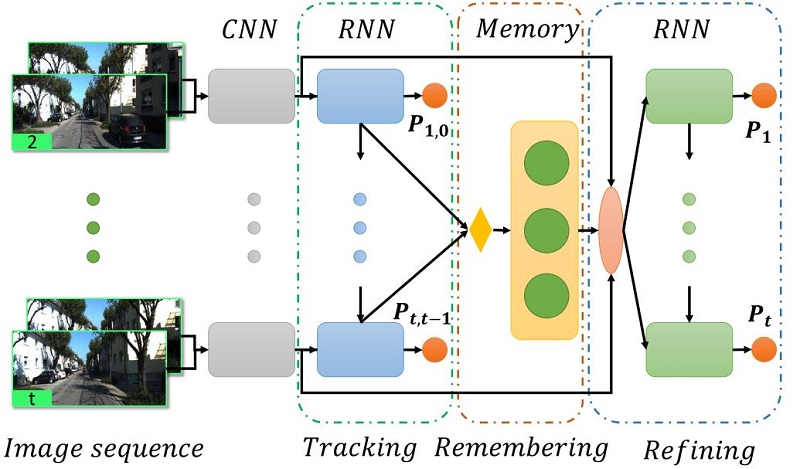

---
# Feel free to add content and custom Front Matter to this file.
# To modify the layout, see https://jekyllrb.com/docs/themes/#overriding-theme-defaults
title: Welcome
layout: page_no_title
---
<table style="border:0px">
<tr style="border:0px">
	<td style="border:0px">
		
	</td>
	<td style="border:0px">
		I am a master student in computer vision at Key Laboratory of Machine Perception, Peking University. My research interests include SLAM, visual odometry, relocalization, and visual perception.  
		Before that, I received the B.S. degree in machine intelligence from School of EECS, Peking University in 2016.  
		<a href="http://www.klmp.pku.edu.cn/">[Key Laboratory of Machine Perception, Peking University]</a> 
		<a href="https://scholar.google.ca/citations?user=G2sYDPkAAAAJ&hl=en">[Google Scholar]</a>
	</td>
</tr>
</table>

## Publications
<table style="border:0px">
<tr style="border:0px">
	<td style="border:0px">
		
	</td>
	<td style="border:0px">
		<b>Fei Xue</b>, Xin Wang, Shunkai Li, Qiuyuan Wang, Junqiu Wang, Hongbin Zha 
		Beyond Tracking: Selecting Memeory and Refining Poses for Deep Visual Ododmetry 
		<i>IEEE Conference on Computer Vision and Pattern Recognition (CVPR)</i>, 2019 
		<a href="https://arxiv.org/pdf/1904.01892.pdf">[pdf]</a>
		<a href="https://youtu.be/qqzOLu47alw">[video]</a>
		<a href="http://tracer.cs.yale.edu/anicode">[demo]</a>
		<a href="https://github.com/zachzeyuwang/AniCode">[code]</a>
		Oral Presentation
	</td>
</tr>
<tr style="border:0px">
	<td style="border:0px">
		
	</td>
	<td style="border:0px">
		<b>Fei Xue</b>, Qiuyuan Wang, Xin Wang, Wei Dong, Junqiu Wang, Hongbin Zha 
		Guided Feature Selection for Deep Visual Odometry 
		<i>Asian Conference on Computer Vision (ACCV)</i>, 2018 
		<a href="https://arxiv.org/pdf/1811.09935.pdf">[pdf]</a>
		<a href="http://graphics.cs.yale.edu/site/cher-ob-open-source-platform-shared-analysis-cultural-heritage-research">[project]</a>
		<a href="https://github.com/WeiqiJust/CHER-Ob">[code]</a>
	</td>
</tr>
<tr style="border:0px">
	<td style="border:0px">
		
	</td>
	<td style="border:0px">
		Xin Wang, <b>Fei Xue</b>, Zike Yan, Wei Dong, Qiuyuan Wang, Hongbin Zha 
		Continuous-time Stereo Visual Odometry Based on Dynamics Model 
		<i>Asian Conference on Computer Vision (ACCV)</i>, 2018 
		<a href="https://www.researchgate.net/publication/332103736_Continuous-time_Stereo_Visual_Odometry_Based_on_Dynamics_Model">[pdf]</a>
	</td>
</tr>
<tr style="border:0px">
	<td style="border:0px">
		
	</td>
	<td style="border:0px">
		Zeyu Wang, Xiaohan Jin, <b>Fei Xue</b>, Renju Li, Hongbin Zha, Katsushi Ikeuchi 
		Perceptual Enhancement for Stereoscopic Videos Based on Horopter Consistency 
		<i>ACM Conference on Virtual Reality Software and Technology (VRST)</i>, 2016 
		<a href="https://www.researchgate.net/publication/308794549_Perceptual_Enhancement_for_Stereoscopic_Videos_Based_on_Horopter_Consistency">[pdf]</a>
		<a href="https://youtu.be/EMN9zlDqXlM">[video]</a>
	</td>
</tr>
<tr style="border:0px">
	<td style="border:0px">
		
	</td>
	<td style="border:0px">
		Zeyu Wang, Xiaohan Jin, <b>Fei Xue</b>, Xin He, Renju Li, Hongbin Zha 
		Panorama to Cube: A Content-Aware Representation Method 
		<i>ACM SIGGRAPH Asia Technical Briefs</i>, 2015 
		<a href="https://www.researchgate.net/publication/281589647_Panorama_to_Cube_A_Content-Aware_Representation_Method">[pdf]</a>
		<a href="https://youtu.be/wJy2ZAhunP0">[video]</a>
		<a href="https://github.com/zachzeyuwang/Panorama-to-Cube">[code]</a>
	</td>
</tr>
</table>
